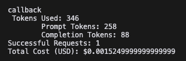

# Feedback Categorization using AI (OpenAI)

[Leia em Português](README_PT.md)


## Objective

This POC aims to categorize customer comments using OpenAI.

A analysis will be done based on the text of the comment to assign a specific category that best describes the feedback.

The categories considered are:

- **ATTENDANCE**
- **PAYMENT**
- **COMFORT**
- **WAITING_TIME**
- **PRODUCT**
- **PRODUCT_AVAILABILITY**
- **PRICE**
- **PRODUCT_QUALITY**
- **COMPLIMENT**
- **NONE**
- **INTERESTS**
- **FINANCIAL_PRODUCTS**

</br>
</br>

The `category` property in the object will be filled by the IA after the analysis of the comment.

| Input (comment) | Output (category) |
|----------|----------|
| I was very well attended by the sellers, all friendly and helpful.  | ATTENDANCE  |
| The store is well organized and comfortable, I liked the spacious area.  | COMFORT  |
| I bought a shoe that had a defect, but it was replaced quickly.  | PRODUCT_QUALITY  |

A log will be generated with the number of tokens used and the cost in dollars, as below:



## General Summary

- This code creates a Flask API with a route /categorization.
- The categorization logic is separated in the controller module.


## Environment Configuration and Application Initialization

### Prerequisites: 

- Python 3.3+
- Get an api-key from the OpenAI site - https://platform.openai.com/api-keys


### 1. Create and activate the virtual environment

```
  python -m venv venv
  source venv/bin/activate  # Windows: `venv\Scripts\activate`
```

### 2. Install the dependencies

```
  pip install -r requirements.txt
```

### 3. Start the application 

```
cd app
python app.py
```

### 4. Access the route

Access the route `/categorization` to perform categorization of comments:

Request (with cURL):

> In the command line, replace `<api-key>` with your OpenAI api-key.


```
curl --location 'http://127.0.0.1:5000/categorization' \
--header 'api-key: <api-key>' \
--header 'model: gpt-4o' \
--header 'Content-Type: application/json' \
--data '{
    "categories": ["ATTENDANCE", "PAYMENT", "COMFORT", "WAITING_TIME", "PRODUCT", "PRODUCT_AVAILABILITY", "PRICE", "PRODUCT_QUALITY", "COMPLIMENT", "NONE", "INTERESTS", "FINANCIAL_PRODUCTS"],
    "comments": [
        {
            "id": 1,
            "comment": "I was very well attended by the sellers, all friendly and helpful."
        },
        {
            "id": 2,
            "comment": "The store is well organized and comfortable, I liked the spacious area."
        },
        {
            "id": 3,
            "comment": "I bought a shoe that had a defect, but it was replaced quickly."
        }
    ],
    "instructions": "You are an expert in categorizing comments. Categorize each comment with its respective category."
}'
```

### Input Data

request body (JSON):

```
{
    "categories": ["ATTENDANCE", "PAYMENT", "COMFORT", "WAITING_TIME", "PRODUCT", "PRODUCT_AVAILABILITY", "PRICE", "PRODUCT_QUALITY", "COMPLIMENT", "NONE", "INTERESTS", "FINANCIAL_PRODUCTS"],
    "comments": [
        {
            "id": 1,
            "comment": "I was very well attended by the sellers, all friendly and helpful."
        },
        {
            "id": 2,
            "comment": "The store is well organized and comfortable, I liked the spacious area."
        },
        {
            "id": 3,
            "comment": "I bought a shoe that had a defect, but it was replaced quickly."
        }
    ],
    "instructions": "You are an expert in categorizing comments. Categorize each comment with its respective category."
}
```


### Response:

```
{
    "data": [
        {
            "category": "ATTENDANCE",
            "comment": "I was very well attended by the sellers, all friendly and helpful.",
            "id": 1
        },
        {
            "category": "COMFORT",
            "comment": "The store is well organized and comfortable, I liked the spacious area.",
            "id": 2
        },
        {
            "category": "PRODUCT_QUALITY",
            "comment": "I bought a shoe that had a defect, but it was replaced quickly.",
            "id": 3
        }
    ],
    "ok": true
}
```

## Observations

Mock Data File: More examples of comments without categorization can be found in the mockdata.json file.

Required Headers: Ensure that the headers api-key and model are included with appropriate values.

Customization: The list of categories and comments can be adapted according to the project's needs.
